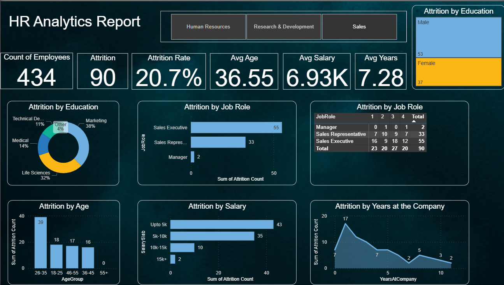

# 📊 HR Analytics Dashboard – Employee Attrition & Workforce Insights

## 📌 Project Overview
This project is an **HR Analytics Dashboard** created using **Power BI**.  
It provides actionable insights into employee **attrition, performance, satisfaction, and compensation trends**.  

By analyzing the HR dataset, the dashboard enables HR managers and business leaders to:  
- Monitor **attrition rate** and identify high-risk employee groups  
- Understand workforce **demographics** and distribution  
- Assess **job satisfaction, work-life balance, and overtime impact**  
- Explore **compensation trends** across departments and roles  
- Support **data-driven HR decisions** for retention and engagement  

---

## 📂 Dataset Used
- **File Name:** `HR_Analytics.csv`  
- **Size:** 1,480 employee records, 38 attributes  
- **Key Features:**  
  - 👤 **Demographics:** Age, Gender, Marital Status, AgeGroup  
  - 🏢 **Work Details:** Department, JobRole, JobLevel, BusinessTravel  
  - 💰 **Compensation:** MonthlyIncome, SalarySlab, PercentSalaryHike, StockOptionLevel  
  - 📊 **Performance & Engagement:** Attrition, JobSatisfaction, PerformanceRating, OverTime, WorkLifeBalance  
  - 📈 **Career Progression:** TotalWorkingYears, TrainingTimesLastYear, YearsAtCompany, Promotions  

---

## 📊 Dashboard Visualizations

The **Power BI dashboard** contains multiple interactive pages:

### **1. Attrition Overview**
- Total Employees vs. Employees Left  
- Attrition % by Age Group, Department, and Gender  
- Overtime vs. Attrition comparison  

### **2. Demographics Analysis**
- Employee distribution by Age, Gender, and Marital Status  
- Department & Job Role breakdown  

### **3. Satisfaction & Work-Life Balance**
- Job Satisfaction vs. Attrition  
- Work-Life Balance impact on retention  
- Environment Satisfaction and Relationship Satisfaction analysis  

### **4. Compensation & Benefits**
- Monthly Income by Department & Job Level  
- Salary Slab distribution  
- Effect of Percent Salary Hike & Stock Options on Attrition  

### **5. Career & Growth Trends**
- Total Working Years vs. Attrition  
- Training Times Last Year distribution  
- Years at Company, Promotions, and Career progression  

---

## 📈 Key Insights Discovered
- Employees with **low job satisfaction** and **poor work-life balance** have **higher attrition**  
- **OverTime workers** are more likely to leave than non-overtime employees  
- **Younger employees (18–25)** show higher attrition due to early career mobility  
- **Sales and R&D departments** experience the highest turnover  
- Compensation factors like **salary hikes** and **stock options** influence retention  

---

## 🛠 Tools & Technologies
- **Power BI** → Dashboard development & visualization  
- **CSV Dataset** → HR employee data  

---

## 📁 Folder Structure (Recommended)
